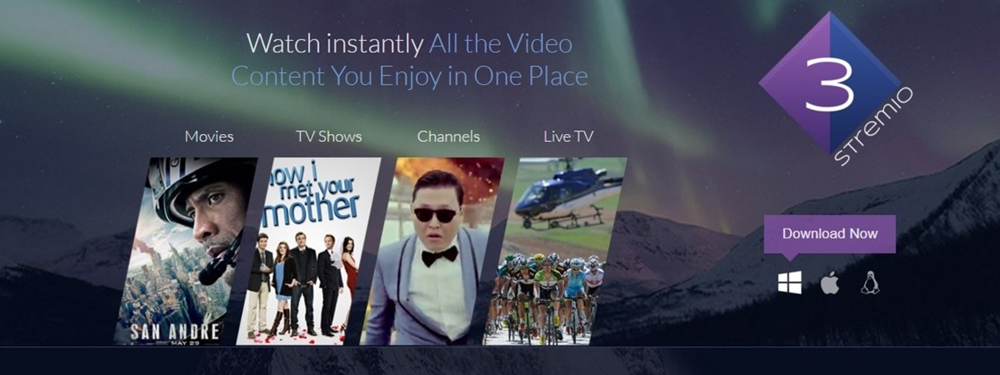

 [![BuyMeCoffee][buymecoffeebedge]][buymecoffee]


# stremio.com Sensor Component

Custom component for information about the most popular movies and series on stremio for the home assistant



# Installation

## HACS

- Have [HACS](https://hacs.xyz/) installed, this will allow you to easily update.

- Add https://github.com/hudsonbrendon/sensor.stremio as a custom repository with Type: Integration
- Click Install under "Stremio" integration.
- Restart Home-Assistant.

## Manual

- Copy directory custom_components/stremio to your <config dir>/custom_components directory.
- Configure.
- Restart Home-Assistant.

# Configuration

To access the movies, configure as shown below:

```yaml
- platform: stremio
  media: movie
```

to access the series, configure as shown below:

```yaml
- platform: stremio
  media: series
```

# Upcoming media card support

To view the movies from the configured cinema, we use the [upcoming-media-card](https://github.com/custom-cards/upcoming-media-card), install via hacs and add the configuration below (Remembering to replace sensor.cinepolis with your configured sensor) in a manual card:

```yaml
type: custom:upcoming-media-card
entity: sensor.stremio_series
max: 10
```
If you want the card in fanart format, configure it like this:

```yaml
type: custom:upcoming-media-card
entity: sensor.stremio_series
max: 10
image_style: fanart
```

# Debugging

```yaml
logger:
  default: info
  logs:
    custom_components.stremio: debug
```

[buymecoffee]: https://www.buymeacoffee.com/hudsonbrendon
[buymecoffeebedge]: https://camo.githubusercontent.com/cd005dca0ef55d7725912ec03a936d3a7c8de5b5/68747470733a2f2f696d672e736869656c64732e696f2f62616467652f6275792532306d6525323061253230636f666665652d646f6e6174652d79656c6c6f772e737667